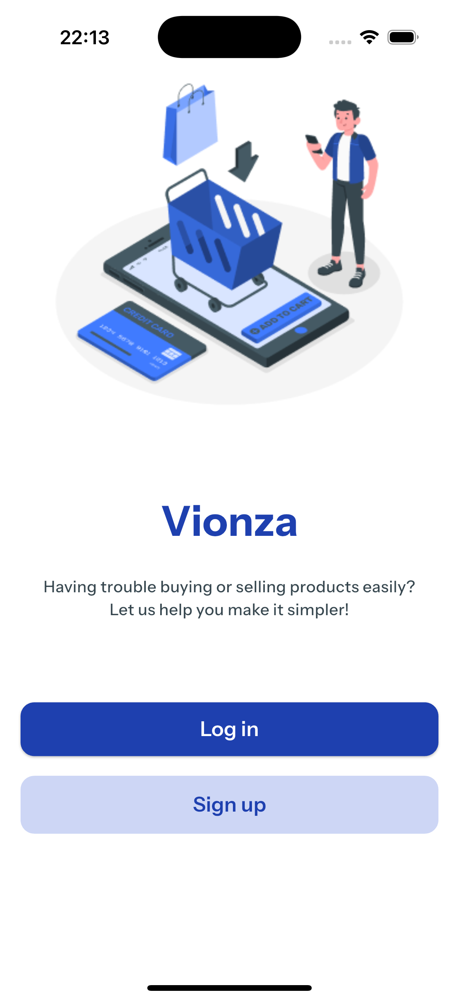
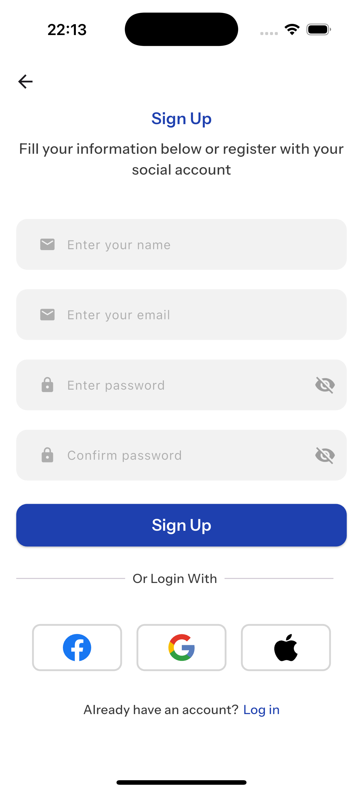
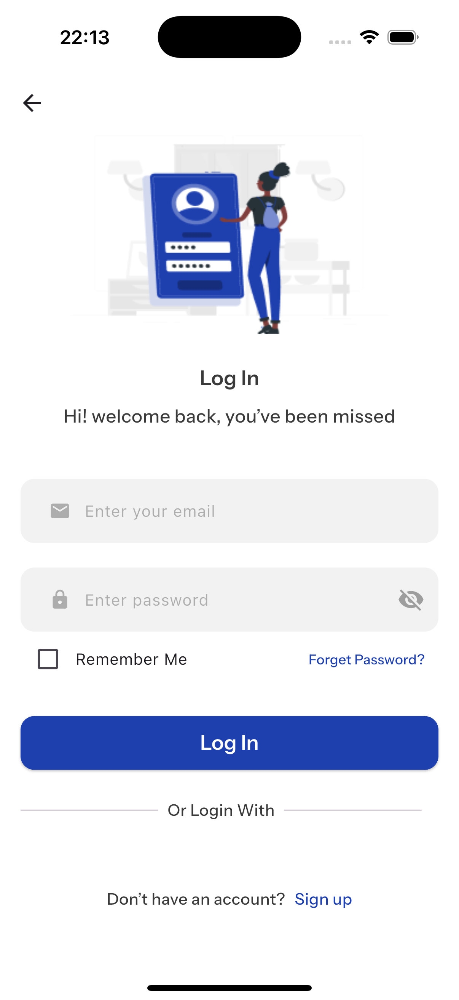
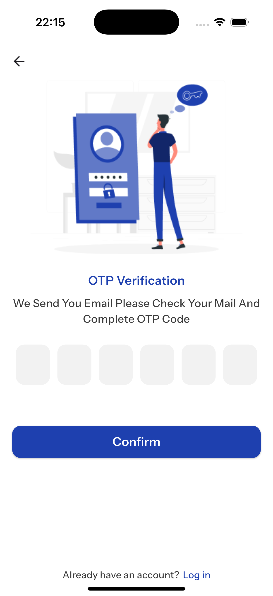
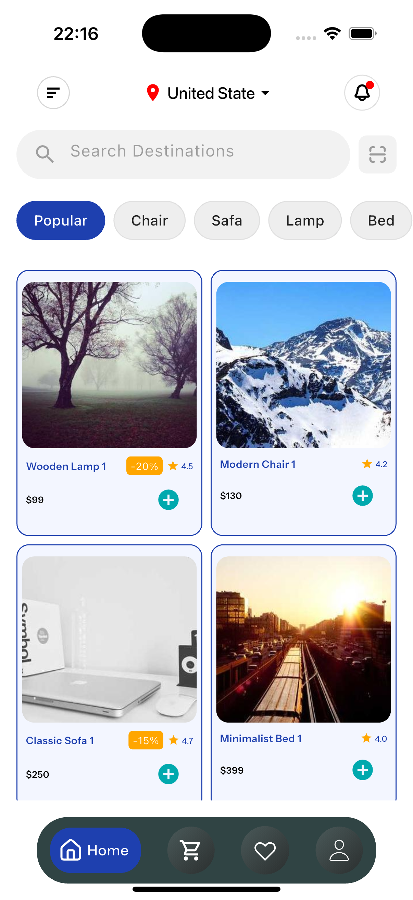

# E-Ticaret Uygulaması 

Bu proje, Clean Code prensipleri, modüler mimari ve modern bir durum yönetimi yaklaşımı (Riverpod) kullanılarak geliştirilmiş temel bir e-ticaret uygulamasıdır.  
Odak noktam, uygulamanın **ölçeklenebilir**, **bakımı kolay** ve **mimari açıdan sağlam** bir yapıda olmasıdır.

---

##  1. Uygulanan Temel Özellikler

### ✅ 1.1. Kimlik Doğrulama ve Kullanıcı Yönetimi (Simülasyon)

- **Kayıt & Giriş Akışı:** Kullanıcıların giriş/kayıt işlemleri için UI ve akış tasarlandı.  
- **Yerel Oturum Yönetimi:** Backend olmadığı için kullanıcı verileri `SharedPreferences` üzerinde saklanarak simüle edildi.  
- **"Beni Hatırla" Özelliği:** Kullanıcının mail/şifre bilgilerinin hatırlanması sağlandı.  
- **Sosyal Giriş Simülasyonu:** Google / Facebook / Apple giriş butonları arayüzde entegre edildi.  
- **OTP Akışı:** Tek kullanımlık doğrulama kodu ekranı (Verification) tasarlandı.

---

### 🛍️ 1.2. Ürün Yönetimi & Listeleme

- **Mock Veriyle Ürün Listeleme:** Ürün listeleri `ProductService` üzerinden mock verilerle yönetildi.
- **Kategori Bazlı Filtreleme:** Kategori çubuğundaki seçimlere göre liste dinamik olarak güncellenir.
- **Arama Çubuğu:** Ürün listesinde arayüzsel arama alanı tasarlanmıştır.

---

### 🎨 1.3. Kullanıcı Arayüzü (UI/UX)

- **Yeniden Kullanılabilir Bileşenler:**  
  - `CustomTextField`  
  - `CustomElevatedButton`  
  - `CustomAppBar`  
  gibi bileşenler **core/components** altında oluşturuldu.

- **Tasarım Sabitleri:**  
  - Renkler (`AppColor`)  
  - Boşluklar (`AppSpace`)  
  ayrı klasörlerde tanımlandı.

- **Navigasyon Yönetimi:**  
  `NavigatorManager` mixin’i ile sayfa yönlendirmeleri merkezi bir yapıda toplandı.

---

## 🧩 2. Teknik Yapı ve Mimari

Bu projede modern ve esnek bir yapı kurmak için aşağıdaki mimari tercihleri uyguladım:

### 🟦 **State Management → Riverpod**
- Tüm iş mantığı UI’dan ayrıldı.
- `StateNotifier` ve `StateProvider.family` gibi ileri seviye Riverpod yapıları kullanıldı.
- Ürün filtreleme ve UI güncellemeleri tamamen Riverpod üzerinden yönetilir.

### Mimari Katmanlama ve Dizayn Prensibi
Proje, Temiz Kod (Clean Code) prensiplerine uygun olarak, sorumlulukları net bir şekilde ayrılmış mantıksal katmanlara göre organize edilmiştir. Bu yapı, projenin büyümesi, bakımı ve gelecekteki API entegrasyonlarına kolay adaptasyonu için kritik öneme sahiptir.

### 📦 Veri Yönetimi
- Ürünler mock olarak servis üzerinden sağlandı.
- Filtreleme işlemleri Riverpod ile state tabanlı şekilde yönetiliyor.

---

## ⚠️ 3. Önemli Not (Simülasyon Açıklaması)

Bu proje mimariyi ve akışı göstermek üzere geliştirilmiştir.  
Gerçek bir Backend bulunmamaktadır.

Kimlik bilgileri `SharedPreferences` üzerinde **düz metin** olarak saklanmıştır.  
Bu yalnızca DEMO / CASE amaçlı yapılmıştır.

Gerçek bir projede:
- Şifreler **cihazda saklanmaz**.  
- Backend tarafında hashing yapılır.  
- Kimlik doğrulama JWT/Token ile sağlanır.

---

## 📸 4. Ekran Görüntüleri

| Ekran | Açıklama | Görsel |
|------|----------|--------|
| **Splash** | Splash sayfası |  |
| **Welcome** | Kullanıcı karşılama ekranı |  |
| **Kayıt** | Kullanıcı kayıt formu ve sosyal giriş seçenekleri |  |
| **Giriş** | Özelleştirilmiş TextField ve butonlarla giriş akışı |  |
| **Doğrulama** | Tek kullanımlık şifre doğrulama akışı |  |
| **Ana Sayfa** | Kategori filtreleme ve ürün kartları listesi |  |

---

## 🏁 Sonuç

Bu proje, Flutter ile:

- Temiz mimari  
- Riverpod durum yönetimi  
- Modüler yapı  
- Yeniden kullanılabilir UI bileşenleri  

konularındaki yetkinliğimi göstermek üzere hazırlanmıştır.

E-ticaret uygulaması için sağlam bir temel ve ileri seviye bir proje iskeleti oluşturmayı amaçlar.

